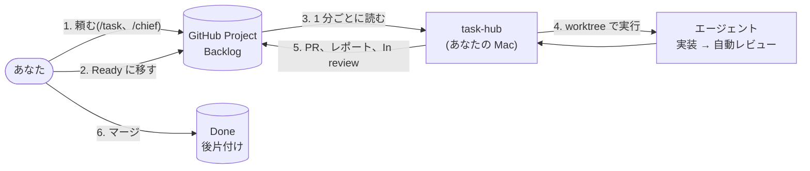

# task-hub

**GitHub Project のカードを Ready に移すと、手元のコーディングエージェントが実装して PR を出す。**

[](https://github.com/jyoka/task-hub/actions/workflows/windows.yml)

あなたが決めるのは 2 つだけです。

- **始めてよいか**: カードを Ready に移す
- **入れてよいか**: PR をマージする

その間の実装、テスト、レビュー、PR、止まったときの仕分け、順番待ち、後片付けは、task-hub とエージェントが進めます。
エージェントは Claude Code、Codex、Pi、Kiro など、非対話モードを持つ CLI なら何でも使えます。

> **Kiro IDE で使う人は [docs/kiro-quickstart.md](docs/kiro-quickstart.md) へ。** このリポジトリを Kiro IDE で開き、
> チャットに「セットアップして」と言うだけで入ります(ターミナルも管理者権限も要りません)。

## しくみ



- 状態はすべて GitHub にあります。スマホから Ready に移しても始まります
- エージェントがするのは「ファイルを編集し、テストし、レポートを書く」ことだけです。git、PR、Issue へのコメントは
  task-hub がコードで行うので、どのエージェントでも同じ形の PR になります
- LLM を使うのは、実装、レビュー、止まった理由の仕分けの 3 か所だけです。いつ始めるか、通知、後片付けはコードが決めます

## 特長

- **1 タスク = 1 ブランチ = 1 worktree = 1 PR**。最大 5 つを並行で動かします
- **PR の前に自動レビュー**: 新しいコンテキストのエージェントが受け入れ条件を 1 つずつ確かめ、必要なら 1 回差し戻します
- **止まっても続きから**: Blocked の理由を仕分けて Issue にコメントします。Goal に答えを書いて Ready に戻すと、同じ PR で続きます
- **前後関係**: GitHub の「Blocked by」の待ち先が終わるまで、カードは始まりません
- **知らせてくれる**: In review、Blocked、長引いている実行を、herdr か OS の通知で出します(LLM は使いません)
- **ボードを横に**: Claude Code のペイン、Kiro のサイドバー、`task list --watch` で、いつでも見えます
- **軽い**: Python 標準ライブラリだけ。インストールするのは clone 1 つです

## はじめる

必要なもの: macOS(Windows は [docs/windows.md](docs/windows.md))、Python 3.10 以上、git、ログイン済みの `gh`、
ログイン済みのエージェント CLI 1 つ以上。

```sh
# 1. 動かす用の clone を入れる
git clone https://github.com/jyoka/task-hub.git ~/.local/lib/task-hub
ln -sfn ~/.local/lib/task-hub/bin/task ~/.local/bin/task

# 2. GitHub Project を使う権限
gh auth refresh -s project

# 3. 設定を書いて(下)、確かめる
task list
```

```ini
; ~/.config/task-hub/config.ini
[board]
project = <owner>/<Project の番号>
issues = <owner>/<Issue を置くリポジトリ>

[runner]
agent = claude
reviewer = agent
```

GitHub Project の準備(列と欄)、スキルのインストール、常駐のさせ方は [docs/setup.md](docs/setup.md) にあります。

## 使い方

使い方は 3 通りで、混ぜても構いません。

| 使い方 | やること |
|---|---|
| **総指揮と話す**(おすすめ) | エージェントで `/chief`。話した作業をタスクに分けて提案し、「うん」で登録と開始をし、In review や Blocked になると知らせてきます |
| **会話から登録** | 普段の会話で `/task`。Backlog にカードができるので、やってほしいときに Ready へ移します |
| **ターミナルだけ** | `task new` で登録、`task start <番号>` で開始、`task list` で様子を見ます |

Ready のカードを自動で始めるには、`task watch` を動かしておきます(1 分ごとに確認)。

例: 「ログインを直す」を頼んで、マージするまで。

```
あなた      /task(または /chief に話す)            → Issue jyoka/tasks#12、Backlog
あなた      カードを Ready に移す                    → task-hub が開始                 In progress
worker      編集し、テストし、レポートを書く
reviewer    受け入れ条件を PR 全体と照らし合わせる   → pass(needs changes なら 1 回差し戻し)
task-hub    task/12 を push し、PR を作り、レポートと判定を Issue にコメント   In review
あなた      PR をレビューしてマージ                  → Issue が閉じる                  Done
```

Goal の書き方、タスクの分け方、前後関係、調べもののタスク、設定の詳細は [docs/usage.md](docs/usage.md) にあります。

## タスクの一生

| 列 (Status) | 何が起きているか | あなたの対応 |
|---|---|---|
| **Backlog** | 登録済み、未承認 | やってほしいときに Ready へ |
| **Ready** | 承認済み。枠(最大 5)が空けば始まる。待ち先があれば、終わるまで待つ | なし |
| **In progress** | worker が作業中。自動レビューと差し戻しもこの間 | なし |
| **In review** | PR ができた(調べものはレポートだけ) | PR をレビューしてマージ |
| **Blocked** | エージェントが何かを必要としている、自動レビューが通らなかった、または実行が失敗した | 答えを Goal に書き足して Ready へ |
| **Done** | PR がマージされた。後片付けが済み、これを待っていたタスクが始まる | なし |

列の上にあるのは、最後に動いたカードです。カードが 100 枚を超えると、古い Done のカードをアーカイブします。

## コマンド

| コマンド | すること |
|---|---|
| `task` | ボードと同期し、Ready のカードを始め、あなたの対応が必要なものを出す |
| `task list [--watch] [--max-age 秒]` | 開いているカードの一覧(読むだけ) |
| `task new --title ... --repo owner/name --goal ...` | タスクを登録する(`--base`、`--agent`、`--research`、`--blocked-by 12,14`) |
| `task start [<番号>] [--agent 名前]` | Backlog を承認する、Blocked を再実行する |
| `task watch` | Ready のカードを自動で始める(1 分ごと) |
| `task show <番号> [--full \| --digest]` | Issue と最新のレポート |
| `task log <番号> [--full]` | このマシンでの実行の出力 |
| `task open <番号>` | worktree を IDE で開く(`[ide] open`) |
| `task events [--follow \| --next]` | 最近の出来事(列の移動、仕分け、長引いている実行) |
| `task stats` | 実行の集計(レビュー、差し戻し、Blocked の理由、トークン数) |
| `task done <番号>` | 手で閉じる・取り消す |
| `task update` | 最新のリリースに更新する |
| `task feedback [--feature]` | バグ報告・機能の要望のフォームを開く |

すべてのフラグは `task help` と各コマンドの `--help` で見られます。

## ドキュメント

| はじめる | 使う | 仕組み | 開発する |
|---|---|---|---|
| [setup.md](docs/setup.md) セットアップ | [usage.md](docs/usage.md) 使い方の詳細 | [architecture/hld.md](docs/architecture/hld.md) 全体図 | [CONTRIBUTING.md](CONTRIBUTING.md) PR とテスト |
| [windows.md](docs/windows.md) Windows | [operations.md](docs/operations.md) 運用とトラブル | [architecture/lld.md](docs/architecture/lld.md) 詳細設計 | [architecture/feature-design.md](docs/architecture/feature-design.md) 機能の設計 |
| [kiro-quickstart.md](docs/kiro-quickstart.md) Kiro IDE | [agents.md](docs/agents.md) エージェント | [design.md](docs/design.md) なぜこの作りか | [release.md](docs/release.md) リリース |
| [kiro-ide.md](docs/kiro-ide.md) Kiro の中身 | [task-format.md](docs/task-format.md) Issue と PR の形式 | [lessons.md](docs/lessons.md) わかったこと | [SECURITY.md](SECURITY.md) 脆弱性の報告 |
| | [issue-tracker.md](docs/issue-tracker.md) ほかのスキルから登録 | | |
| | [slack-triage.md](docs/slack-triage.md) Slack から登録 | | |

## バグ報告と要望

`task feedback`(機能の要望は `task feedback --feature`)で、版と OS を入れたフォームが開きます。
質問や相談は [Discussions](https://github.com/jyoka/task-hub/discussions) へ。脆弱性は [SECURITY.md](SECURITY.md) の手順で知らせてください。
