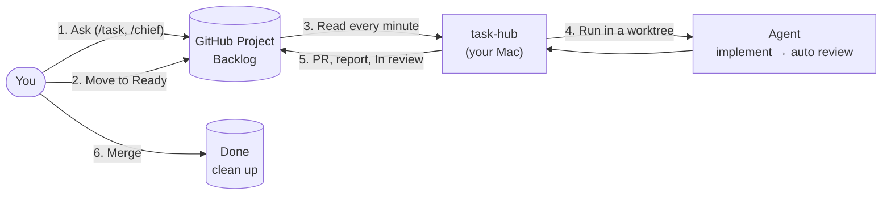

# task-hub

English | [日本語](README.ja.md)

**Move a GitHub Project card to Ready. Your local coding agent implements it and opens a PR.**

[](https://github.com/jyoka/task-hub/actions/workflows/windows.yml)
[](LICENSE)

You make two decisions:

- **May it start?** Move the card to Ready.
- **May it go in?** Merge the PR.

task-hub and your agents do the rest: implement, test, review, open the PR, sort out why a task stopped, wait in
line, and clean up. Any agent CLI with a non-interactive mode works: Claude Code, Codex, Pi, Kiro, and others.

> **Kiro IDE users: see [docs/kiro-quickstart.md](docs/kiro-quickstart.md).** Open this repository in Kiro IDE and
> say "セットアップして" ("set it up") in the chat. You need no terminal and no admin rights.

The detailed docs in `docs/` are in Japanese.

## How it works



- GitHub holds all the state. Move a card to Ready from your phone, and the task starts.
- The agent only edits files, runs tests, and writes a report. task-hub does git, the PR, and the Issue comments in
  code. So every agent produces the same kind of PR.
- An LLM does only three jobs: implement, review, and sort out why a task stopped. Code decides when to start, when
  to notify, and when to clean up.

## Features

- **1 task = 1 branch = 1 worktree = 1 PR.** Up to 5 tasks run at the same time.
- **Review before the PR.** An agent in a fresh context checks each acceptance criterion. It sends the work back once if needed.
- **Continue after a stop.** task-hub sorts out why the task stopped and comments on the Issue. Add the answer to the Goal, move the card to Ready, and the same PR continues.
- **Dependencies.** A card does not start until the tasks in its GitHub "Blocked by" list are done.
- **Notifications.** In review, Blocked, and long runs show as herdr or OS notifications. No LLM is used.
- **Board at your side.** See the board in a Claude Code pane, the Kiro sidebar, or `task list --watch`.
- **Light.** Python standard library only. You install one clone.

## Get started

You need: macOS (Windows: [docs/windows.md](docs/windows.md)), Python 3.10 or later, git, `gh` logged in, and at
least one agent CLI logged in.

```sh
# 1. Install the clone that runs task-hub
git clone https://github.com/jyoka/task-hub.git ~/.local/lib/task-hub
ln -sfn ~/.local/lib/task-hub/bin/task ~/.local/bin/task

# 2. Give gh access to GitHub Projects
gh auth refresh -s project

# 3. Write the config (below), then check it
task list
```

```ini
; ~/.config/task-hub/config.ini
[board]
project = <owner>/<project number>
issues = <owner>/<repository that holds the Issues>

[runner]
agent = claude
reviewer = agent
```

[docs/setup.md](docs/setup.md) tells you how to prepare the GitHub Project (columns and fields), install the
skills, and keep `task watch` running.

## Usage

Use any of the three ways, or mix them.

| Way | What you do |
|---|---|
| **Talk to the chief** (recommended) | Run `/chief` in your agent. It splits what you describe into tasks and proposes them. Say yes, and it registers and starts them. It tells you when a task is In review or Blocked |
| **Register from a chat** | Run `/task` in a normal chat. A card appears in Backlog. Move it to Ready when you want the work done |
| **Terminal only** | Register with `task new`, start with `task start <id>`, and watch with `task list` |

To start Ready cards automatically, keep `task watch` running. It checks every minute.

Example: you ask to fix the login, then merge.

```
You         /task (or tell /chief)                    → Issue jyoka/tasks#12, Backlog
You         Move the card to Ready                    → task-hub starts it           In progress
worker      Edits, tests, writes the report
reviewer    Checks each acceptance criterion          → pass (needs changes: sent back once)
task-hub    Pushes task/12, opens the PR, comments the report and verdict on the Issue   In review
You         Review and merge the PR                   → the Issue closes             Done
```

[docs/usage.md](docs/usage.md) explains how to write a Goal, how to split tasks, dependencies, research tasks, and
the full config.

## Task lifecycle

| Column (Status) | What happens | What you do |
|---|---|---|
| **Backlog** | Registered, not approved | Move to Ready when you want it done |
| **Ready** | Approved. Starts when one of the 5 slots is free. Waits until its dependencies are done | Nothing |
| **In progress** | The worker runs. The auto review and its send-back also happen here | Nothing |
| **In review** | The PR is ready (a research task has only a report) | Review and merge the PR |
| **Blocked** | The agent needs something, the auto review failed, or the run failed | Add the answer to the Goal and move to Ready |
| **Done** | The PR is merged. task-hub cleans up, and tasks that waited for this one start | Nothing |

The card at the top of a column is the one that moved last. When the board has more than 100 cards, task-hub
archives the oldest Done cards.

## Commands

| Command | What it does |
|---|---|
| `task` | Syncs with the board, starts Ready cards, and shows what needs you |
| `task list [--watch] [--max-age seconds]` | Lists the open cards (read only) |
| `task new --title ... --repo owner/name --goal ...` | Registers a task (`--base`, `--agent`, `--research`, `--blocked-by 12,14`) |
| `task start [<id>] [--agent name]` | Approves a Backlog card, or runs a Blocked card again |
| `task watch` | Starts Ready cards automatically (every minute) |
| `task show <id> [--full \| --digest]` | Shows the Issue and the latest report |
| `task log <id> [--full]` | Shows the output of the run on this machine |
| `task open <id>` | Opens the worktree in your IDE (`[ide] open`) |
| `task events [--follow \| --next]` | Shows recent events (column moves, triage, long runs) |
| `task stats` | Sums up the runs (reviews, send-backs, Blocked reasons, tokens) |
| `task done <id>` | Closes or cancels a task by hand |
| `task update` | Updates task-hub to the newest release |
| `task feedback [--feature]` | Opens the bug report or feature request form |

`task help` and `--help` on each command show all the flags.

## Documentation

The docs are in Japanese.

| Get started | Use | How it works | Develop |
|---|---|---|---|
| [setup.md](docs/setup.md) Setup | [usage.md](docs/usage.md) Usage details | [architecture/hld.md](docs/architecture/hld.md) High-level design | [CONTRIBUTING.md](CONTRIBUTING.md) PRs and tests |
| [windows.md](docs/windows.md) Windows | [operations.md](docs/operations.md) Operations and troubleshooting | [architecture/lld.md](docs/architecture/lld.md) Low-level design | [architecture/feature-design.md](docs/architecture/feature-design.md) Designing a feature |
| [kiro-quickstart.md](docs/kiro-quickstart.md) Kiro IDE | [agents.md](docs/agents.md) Agents | [design.md](docs/design.md) Design decisions | [release.md](docs/release.md) Releases |
| [kiro-ide.md](docs/kiro-ide.md) Kiro internals | [task-format.md](docs/task-format.md) Issue and PR formats | [lessons.md](docs/lessons.md) Lessons learned | [SECURITY.md](SECURITY.md) Reporting vulnerabilities |
| | [issue-tracker.md](docs/issue-tracker.md) Registering from other skills | | |
| | [slack-triage.md](docs/slack-triage.md) Registering from Slack | | |

## Bug reports and feature requests

Run `task feedback` (or `task feedback --feature`). It opens a form with your version and OS filled in. Ask
questions in [Discussions](https://github.com/jyoka/task-hub/discussions). Report vulnerabilities as
[SECURITY.md](SECURITY.md) describes.

## License

[MIT](LICENSE)
