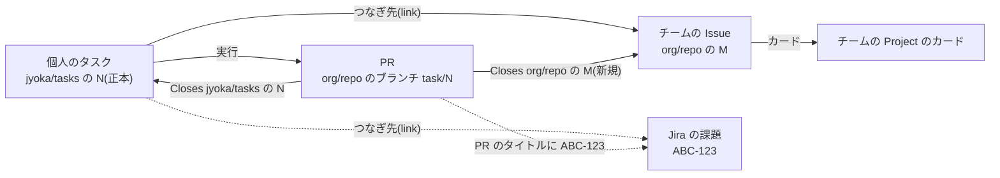
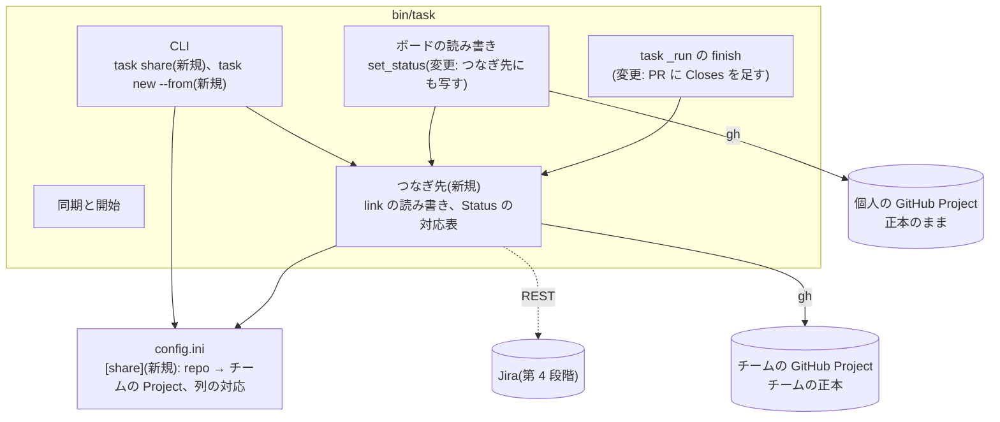
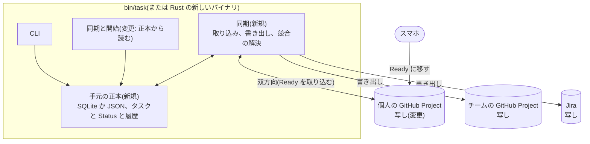
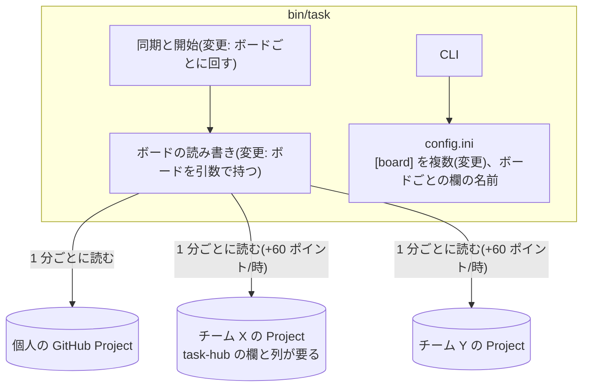
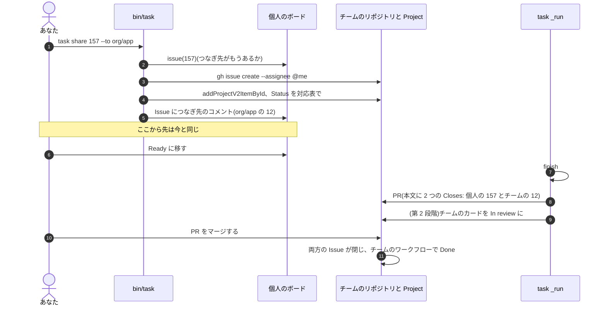

# 個人のタスクとチームのボードをつなぐ

調べもの(task 157、2026-10-11)の設計メモです。実装はまだしません。選択肢と、人が決めることを並べます。
結論は「決めてほしいこと」で人が出します。この文書の「推奨」は、書いた者の案です。

## 何を、なぜ

- 困っていること: 個人のボードで終えたタスクのうち、一部をチームの Project、会社の Jira、コミュニティの
  プロジェクトにも残したい。今は人が手で書き写すしかない
- 利用者の案(2026-10-11 の会話): ローカルの task hub(速い、ターミナルで快適)とクラウドの task hub
  (GitHub、Jira に API で記録)の 2 層にする。ローカルを Rust で書く
- やること: つなぐ先のモデル、正本の置き場所、同期の仕組み、Rust の価値、段階の案を比べる
- やらないこと: 実装。今の利用者の作業(Ready に移す、マージする)を変える案は、最小の一歩に入れない

## 1. つなぐ先のモデル

### 登場するもの

| もの | 持ち主 | task-hub が書けるもの | 見る人 |
|---|---|---|---|
| 個人のボード | あなた(user の Project + 非公開の Issue リポジトリ) | すべて | あなただけ |
| チームの GitHub Project | 組織(org の Project + チームのリポジトリ) | Issue、カード、欄(権限しだい) | チーム |
| Jira | 会社(Jira Cloud のプロジェクト) | 課題、コメント、遷移(権限しだい) | 会社 |
| コミュニティのプロジェクト | 他人(公開リポジトリ、その Project) | Issue と PR とコメントだけ。Project の欄はふつう書けない | 誰でも |

今でも半分はつながっています。Target repo をチームのリポジトリにすると、PR はチームのリポジトリに出ます。
PR の本文には Report、Please review、`Closes <issues repo>#<番号>` が入ります(`AgentReport.pr_body`)。
チームから見えるのは PR だけで、チームのボードのカードとは結びついていません。

### 関係: タスクに「つなぎ先」を 0 個以上持たせる



- つなぎ方は 2 向きある
  - 外へ出す(個人 → チーム): 個人のタスクから、チームの Issue を作る。`task share`
  - 取り込む(チーム → 個人): 自分に割り当てられたチームの Issue から、個人のタスクを作る。`task new --from <URL>`
- 同期は「片方が持つ欄を、もう片方へ写す」だけにし、同じ欄を両方で編集しない

### どの欄を、いつ、どの向きに

| 欄 | 向き | いつ | 案 |
|---|---|---|---|
| タイトル | 個人 → チーム | つないだとき 1 回 | そのまま写す。あとで直しても写さない |
| 本文(Goal) | 写さない(既定) | - | Goal はエージェント向けで、私的な文脈も入る。チームの本文は人が書くか、要約を 1 回だけ |
| 担当者 | チーム側は「あなた」 | つないだとき | エージェントやボットにはしない。実行したのはあなたの手元 |
| Status | 個人 → チーム | In progress、In review、Done になったとき | チームの列の名前は対応表で写す。Done はマージで GitHub が動かす(下) |
| Status(チームで閉じられた) | チーム → 個人 | 見つけたとき | 個人のカードは動かさず、出来事で知らせるだけ |
| コメント | 写さない | - | Report は PR にある。チームの Issue には PR へのリンクだけ |
| PR | 両方から参照 | PR を作るとき | PR の本文に `Closes org/repo#M` を足す。マージで両方の Issue が閉じる |

PR に `Closes` を 2 つ書くと、デフォルトブランチへのマージで GitHub が両方の Issue を閉じます。チームの Project に
「Item closed」のワークフローがあれば、チームのカードも Done になります。Done の同期に API の呼び出しが要りません。
デフォルトブランチ以外へのマージでは閉じないので、今の個人の Issue と同じく task-hub が閉じます(決定事項 10)。

## 2. 正本をどこに置くか

### 案

| 案 | 中身 | 利点 | 費用 | 危険 |
|---|---|---|---|---|
| A. 今のまま + つなぎ先(推奨) | 個人の正本は個人の Project。チームの Issue はチームの正本。task-hub は「つなぎ先」と、決まった欄だけを写す | 今の作業も、スマホから Ready に移すことも変わらない。同期の向きが 1 つなので競合がない | つなぎ先の記録、チームの Project の対応表 | チームのワークフローが Status を上書きする(design.md の既知の制限と同じ) |
| B. ローカル正本 + クラウドへ同期 | 手元の SQLite か JSON が正本。個人の Project もチームの Project も写し | 読むのにネットワークが要らない。GitHub 以外(Jira だけ、ボードなし)にも合わせやすい | 双方向の同期(スマホの Ready を取り込む)、競合の解決、複数マシンの調停、移行 | 決定事項 1 で廃止した「2 か所の同期」に戻る。0.1 のロックと競合の苦労をもう一度する |
| C. 複数のボード、それぞれが正本 | 個人のボードに加えて、チームの Project も task-hub が直接見る。チームのカードを Ready(相当)にすると始まる | 写しがない。チームの人もチームの画面で状況が分かる | ボードごとの欄の対応、watch の読み取りがボードの数だけ増える | チームのボードに task-hub の列や欄が要る。チームの決まりと衝突する。他人のカードが始まらないようにする判定が要る |

### B の費用を詳しく(ローカル正本)

| 項目 | 今(A) | B |
|---|---|---|
| 競合 | 起きない(書くのは task-hub とあなたで、正本は 1 つ) | スマホで動かしたカードと、手元の変更がぶつかる。どちらを勝たせるかの規則が要る |
| オフライン | 読めない(キャッシュが 90 秒より古いと GitHub を読む) | 読める、書ける。ただし実行は git の push、PR、エージェントの API でネットワークが要る。得はほぼ一覧と登録だけ |
| 複数マシン | 想定していない(HLD 7 章)が、ボードはどこからでも見える | 手元の正本をマシン間で合わせる仕組みが新たに要る。今より悪くなる |
| スマホから Ready | できる(決定事項 2) | 個人の Project を写しとして残し、Status を取り込む双方向の同期を書かない限りできなくなる |
| 速さ | キャッシュが新しい `task list` は 0.09 秒(下の測定) | 0.09 秒が数十ミリ秒になる程度(推測)。今のキャッシュで差はほぼ消えている |
| 履歴、コメント、画面 | GitHub が持つ | 自分で作るか、写しの側に頼る |

### HLD の部品図がどう変わるか

案 A(変わる箱だけ。「新規」「変更」と書く):



案 B(正本が手元に移る。入口と表示は変えずに済む):



案 C(ボードが複数になる):



## 3. 同期の仕組み

### 比べる

| 仕組み | 中身 | 利点 | 費用 | 危険 |
|---|---|---|---|---|
| 手動の「チームに出す」(`task share`)(推奨の第 1 段階) | 人が選んだタスクだけ、チームの Issue を作ってつなぐ。以後は Status を写し、PR に `Closes` を足す | 選ぶのが人なので、私的なタスクが漏れない(決定事項 8 の「登録は明示的」と同じ考え)。呼び出しは数回 | コマンド 1 つ、つなぎ先の記録 | 出し忘れ。チームの決まり(テンプレート、ラベル)に合わない Issue ができる |
| 規則による一方向の書き出し | 設定の規則(Target repo が org/x なら、など)に合うタスクを自動でチームに出す | 出し忘れがない | 規則の設定、規則の誤り | 出したくないタスクが出る。消しても通知や履歴は残る |
| 双方向の同期 | チームと個人の両方を見張り、変わった側を写す | どちらで動かしても合う | 両方の読み取り(1 ボード 1 分ごとに 1 ポイント以上)、欄ごとの勝ち負けの規則、ループの防止 | 競合と、写し合いのループ。user の Project には webhook がない(下)ので見張りはポーリング |
| PR だけでつなぐ(呼び出しなし) | Issue は人が作る。Goal に「つなぎ先」を書けば、PR に `Closes` かキーを入れる | 一番小さい | 本文の書き方の約束 | 本文の文章からの読み取りは揺れる(決定事項 17 で「安全側にだけ使う」とした理由と同じ) |

### GitHub の制約(2026-10-11 に docs.github.com で確認)

| 制約 | 中身 | 設計への影響 |
|---|---|---|
| GraphQL の上限 | 1 時間 5000 ポイント(ユーザーごと、REST とは別) | 今の watch は約 60。チームのボードを毎分読むと 1 ボード 60 ずつ増える |
| 2 次の上限 | GraphQL は 1 分 2000 ポイント。mutation を含む要求は 5 点で数える | `task share` 1 回は数点。問題にならない |
| 内容を作る要求 | 1 分 80 回、1 時間 500 回まで | 一括で何百も出す使い方はしない |
| Projects の操作 | GraphQL だけ(lld.md 7 章) | 今と同じ `gh api graphql` を使う |
| Project の webhook | `projects_v2_item` は organization だけ、public preview。user の Project には webhook を作れない | 個人のボードの変化は今と同じくポーリング。チームの Project の webhook は受ける場所(サーバー)が要るので使わない |
| 非公開リポジトリのカード | 別の Project に足せるが、リポジトリを読めない人には中身が見えない | 個人の非公開 Issue をそのままチームの Project に足しても、チームには見えない。チームのリポジトリに新しい Issue を作る |
| 同じ Issue を複数の Project に | できる | 取り込み(チーム → 個人)では、チームの Issue をそのまま個人の Project に足す手もある。ただし今の `tasks()` は Issue リポジトリ以外のカードを捨てる |
| `Closes` | デフォルトブランチへのマージでだけ閉じる。複数書ける | Done はマージで両方閉じる。それ以外は task-hub が閉じる |
| 会社のアカウント | Enterprise Managed Users(EMU)なら個人のアカウントと別。lessons.md の「まだ検証できること」4 で未確認 | チームの側だけ別の認証(`gh` のアカウントか `GH_HOST`)になりうる。設定で分ける |

### Jira の制約(2026-10-11 に Atlassian の docs と community で確認。実物では未確認)

| 制約 | 中身 | 設計への影響 |
|---|---|---|
| Status | 直接は書けない。ワークフローの遷移(transition)の id で動かす。id はプロジェクトとワークフローごとに違う。`Transition issues` の権限が要る | 列の対応表は「Status の名前」ではなく「遷移」を探して当てる。遷移に画面があると欄の指定も要る |
| 本文 | REST v3 は Atlassian Document Format(ADF、JSON)。Markdown ではない(一般に知られている仕様。この調べものでは原文を確かめていない) | Report をそのまま写せない。PR へのリンクだけにする |
| 上限 | 2026-03-02 から、Forge、Connect、OAuth 2.0 の app に時間あたりのポイント制。API トークンの通信は従来の burst の上限だけ | 個人の API トークンなら当面は burst の上限だけ。ただし会社がトークンを許すかは別 |
| webhook | 管理者の設定か app が要る | 見張るならポーリング(JQL)。第 1 段階では見張らない |
| GitHub for Jira | ブランチ名、コミット、PR のタイトルに課題のキー(`ABC-123`)があると、Jira の開発パネルに PR が出る | ブランチは `task/<番号>` のまま(決定事項 5)にして、PR のタイトルにキーを入れれば API なしでつながる。会社が app を入れているかは不明 |

## 4. Rust で書き直す価値

### 測った値

2026-10-11、この Mac(Darwin 25.6.0、`task` は v0.9.0 の動かす用の clone、python3.12)で、各 7 回の中央値です。
ボードは開いたカード 10 枚。GitHub の応答は回によって 0.3 秒ほど揺れます。

| 測ったもの | 中央値 | 最小 | 見方 |
|---|---|---|---|
| `/usr/bin/true`(ネイティブのバイナリの起動) | 0.002 秒 | 0.002 | Rust のバイナリの起動もこの桁と推測(cargo がなく、Rust では測っていない) |
| `python3 -c pass`(3.10) | 0.025 秒 | 0.024 | Python 自体の起動 |
| `task --help`(sh のラッパー + python3.12 + `bin/task` の読み込み) | 0.060 秒 | 0.060 | 2026-10-11 の会話の 0.05 秒とほぼ同じ |
| `task list`(キャッシュが新しい) | 0.091 秒 | 0.088 | #26 のあと。会話の 0.07 秒より少し遅い |
| `task list --max-age 0`(GitHub を読む) | 1.764 秒 | 1.591 | 会話の 2.1 秒より速いが、同じ桁 |
| `gh --version` | 0.026 秒 | 0.025 | `gh` の起動だけ |
| `gh api graphql`(`viewer { login }`) | 0.413 秒 | 0.353 | |
| `curl` で同じ問い合わせ | 0.411 秒 | 0.342 | 小さい問い合わせでは `gh` の上乗せは測れないほど小さい |
| `gh api graphql`(`ITEMS_QUERY`、本物の問い合わせ) | 1.264 秒 | 0.873 | |
| `curl` で `ITEMS_QUERY` | 1.015 秒 | 0.614 | |
| Python の `urllib`(同じプロセスの中)で `ITEMS_QUERY` | 0.826 秒 | 0.715 | プロセスを起こさない場合の下限に近い |
| `curl` の内訳(`rate_limit`) | 接続 0.017、TLS 0.037、最初のバイト 0.280 秒 | | 往復の大半は GitHub の処理 |

キャッシュが新しい `task list` の 0.09 秒の内訳(cProfile): Python の中は 0.05 秒。そのうち import が約 0.02 秒、
子プロセス(`ps` など)3 回が約 0.02 秒。残りはラッパーとインタープリタの起動です。

### 評価

| 観点 | Python のまま | Rust に書き直す |
|---|---|---|
| キャッシュが新しい `task list` | 0.09 秒 | 0.01 秒前後(推測)。差は 0.08 秒で、人が遅いと感じる目安の 0.1 秒より小さい |
| GitHub を読む `task list` | 1.0〜1.8 秒 | ほぼ同じ。`ITEMS_QUERY` は `curl` でも 0.6〜1.1 秒で、待ち時間は GitHub の処理(本文と Blocked by を取る問い合わせ) |
| `gh` を使う分 | 1 回 0.03 秒前後の起動。大きい問い合わせでは 0.25 秒ほど遅い回もあったが、揺れの幅の中 | HTTP を直接話せば消える。ただし Python でも `urllib` で消せる(0.83 秒) |
| 単一バイナリ、依存なし | Python 3.10 以上が要る。macOS の標準(Xcode のコマンドラインツール)の python3 は、この Mac で 3.9.6 で足りない | 1 ファイルを置くだけ。仕事用の Mac で Python を入れられない場合に効く(会社の Mac の事情は不明) |
| `gh` と `git` | 要る | `git` は要る。`gh` をやめると、認証(トークンの保管)を自分で持つことになる |
| 書き直しの費用 | なし | `bin/task` 約 2,900 行と、mod、Kiro の拡張が読む出力の形を同じにする。`tests/test_task.py` は別プロセスのブラックボックスなので流用できるが、偽物の `gh` に頼る部分は HTTP の偽物に変える |
| 決まりとの関係 | AGENTS.md と HLD 8 章「Python 標準ライブラリだけ」 | 決まりを変える。開発者とエージェントの道具(cargo)が増える |

結論の案: 速さだけなら書き直す価値は小さいです。ネットワークを待たなくなれば速くなりますが、それは言語ではなく
「正本を手元に置く」か「キャッシュを使う」かで決まります。キャッシュはすでに 0.09 秒です。書き直す理由になりうるのは、
単一バイナリの配布(Python を入れられない会社の Mac、Windows)のほうです。これは会社の Mac で Python 3.10 以上が
使えるかを確かめてから決められます。

## 段階の案

| 段階 | 中身 | 今の作業への影響 | 費用(GitHub) |
|---|---|---|---|
| 0. 実験(コードなし) | チームの Issue を人が作り、Goal の末尾に「つなぎ先: org/repo#M」と書く。PR を人が編集して `Closes` を足す | なし | なし |
| 1. `task share`(最小の一歩、推奨) | 選んだタスクのチームの Issue を作り、チームの Project に足し、つなぎ先を記録する。`finish` が PR の本文に `Closes org/repo#M` を足す | なし。Ready に移す、マージする、は同じ。`task share` を使わなければ何も変わらない | 1 回あたり Issue の作成 1、カードの追加 1、欄 1〜2、コメント 1。watch は増えない |
| 1'. `task new --from <URL>`(取り込みの最小) | チームの Issue から個人のタスクを作り、同時につなぐ。タイトルと本文の引用を Goal のたたき台にする | なし | 登録 1 回あたり読み 1 回 |
| 2. Status を写す | つないだタスクの `set_status`(In progress、In review)で、チームのカードの Status も変える。マージ以外の Done(`task done`)でチームの Issue を閉じるかは選べる | なし | Status の変化 1 回につき mutation 1(+ チームの Project の id を 1 時間取っておく) |
| 3. チームの変化を知らせる | watch がつないだ Issue のうち開いているものだけを読み、チームで閉じられた、担当が変わったら出来事を出す | なし(知らせるだけ) | 1 回の問い合わせでまとめれば 1 分 1 ポイント、1 時間 +60 |
| 4. Jira | PR のタイトルにキーを入れる(GitHub for Jira 頼み)。次に REST で遷移を動かす | なし | Jira の API トークンと権限 |
| 5. 正本の見直し | 1〜4 の実績で、ローカル正本(案 B)やボードの複数化(案 C)、Rust を考え直す | 変わる | - |

### 第 1 段階 `task share` の形

```
task share <id> --to <owner>/<repo> [--project <owner>/<number>] [--body <text>]
```

- `--project` を省くと `[share]` の対応(リポジトリ → チームの Project)を使う。どちらもなければ Issue だけ作る
- 本文は既定で書かない(タイトルと、個人のタスクへの言及もしない)。`--body` で人が書く
- 担当者はあなた(`gh issue create --assignee @me`)
- もうつないであれば何もしない(AXI の「同じ変更の繰り返しは何もしない」)
- 実行中でも、終わったあとでも使える。PR があれば、次の `finish` か、`task share` がその場で PR の本文を直す

## 変わる部品(HLD)

案 A + 第 1、2 段階の場合です(上の「案 A」の図)。

| 部品 | 変わること |
|---|---|
| `bin/task` の CLI | `task share`、(1' を選べば)`task new --from` を `COMMANDS` に足す |
| `bin/task` のボードの読み書き | `set_status` が、つなぎ先のあるタスクではチームのカードにも写す(第 2 段階)。失敗しても止めない |
| `task _run` の finish | `AgentReport.pr_body` に、つなぎ先の `Closes` を足す |
| 設定 | `[share]`: リポジトリ → チームの Project、列の対応 |

## 流れ(LLD)



Status、段階、出来事の種類は増えません(第 3 段階で、チームの変化の出来事を足すかを決めます)。

## データ

| もの | 書く者 | 読む者 | 形式 |
|---|---|---|---|
| つなぎ先 | `task share`、`task new --from` | `finish`(`issue()` が読むコメントに含まれる)、`set_status` | 個人の Issue のコメント。`<!-- task-hub link -->` で始まり、`org/repo#M` か Jira のキー |
| `[share]` | 人 | `task share`、`set_status` | INI。例: `org/app = org/7`、`status.In review = Review` |
| `board-meta` の写し | `task share` | 同 | チームの Project の id と欄(1 時間取っておく。今の `board-meta.json` と同じ考え) |

つなぎ先を手元のファイルでなく Issue のコメントに置く案にしたのは、別のマシンでも、手元の記録を消したあとでも
読めるからです。`issue()` は今もコメントを読んでいる(レポートと replan)ので、読み取りは増えません。
Goal の本文には書きません(決定事項 12 と同じく、本文は人のもの)。

## 外部の呼び出しと費用

| 呼び出し | 費用 | いつ |
|---|---|---|
| チームの Project の id と欄 | GraphQL 1 | `task share` ごと(取っておけば 1 時間に 1 回) |
| Issue の作成 | `gh issue create`(内容を作る要求 1) | `task share` |
| カードの追加、Status | GraphQL の mutation 2 | `task share` |
| 個人の Issue へのコメント | `gh issue comment` 1 | `task share` |
| チームのカードの Status | GraphQL の mutation 1 | 第 2 段階: つないだタスクの Status が変わるとき |
| つなぎ先の読み取り | `gh issue view` 1 | 第 2 段階: 実行の中は `launch` が読んだ `issue()` の結果を `runs/<id>.json` に入れて使うので増えない。`task done` など実行の外で Status を変えるときだけ 1 回 |

`task watch` の 1 時間あたりの費用(約 60 ポイント)は、第 1、2 段階では変わりません。第 3 段階で約 +60 です。

## 失敗したとき

| 失敗 | 扱い |
|---|---|
| チームのリポジトリに書けない(権限、EMU の別アカウント) | `task share` が `error:` と `help:` を出して終わる。個人のカードは変えない |
| Issue は作れたが、カードの追加か記録のコメントに失敗 | 作った Issue の URL を出し、もう一度の `task share --to` が同じ Issue を拾えるようにする(要検討: タイトルで探すか、URL を渡すか) |
| 第 2 段階の Status の写しに失敗 | 無視して stderr に 1 行(通知とキャッシュの失敗と同じ。lld.md 8 章) |
| チームのワークフローが Status を上書きした | 直さない。写すのは task-hub が Status を変えたときだけ |
| PR がデフォルトブランチ以外にマージされた | 今の個人の Issue と同じく、マージを見つけた同期がチームの Issue も閉じる(閉じるかは決めてほしいこと) |

並行: つなぎ先のコメントを書くのは `task share` だけです。`runs/<id>.json` には書きません(lessons.md「1 つのファイルに
書くのは 1 者だけ」)。

## 互換性

- 古い `bin/task`: つなぎ先のコメントを知らないだけで、今と同じに動く(PR に `Closes` が 1 つ足りないだけ)
- mod と Kiro の拡張: `task list` の出力を変えなければ影響なし。つなぎ先を表示に出すかは後で決める
- Windows: `gh` の呼び出しだけなので差はない
- 今ある PR: つなぐ前に作った PR も、次の `finish` で本文が直る

## 確かめ方

- 再現テスト(偽物の `gh` に「チームのリポジトリ」を足す)
  - `task share` のあとの実行で、PR の本文に `Closes` が 2 つある
  - `task share` を 2 回しても Issue は 1 つ
  - チームのリポジトリに書けないとき、個人のカードと PR は変わらない
- 守る約束(lld.md 9 章に足す案): 「つないでいないタスクの PR、Status、GitHub の呼び出しは、`task share` を足す前と同じ」
- 実際のボードで: 自分の org を 1 つ作り、`Closes` 2 つの PR のマージで両方の Issue が閉じ、チームの Project の
  カードが Done になるか。会社の GitHub(EMU)で個人のアカウントから書けるか

## タスクの分け方

決めてほしいことが決まってからの案です。

1. `task share`(Issue の作成、カードの追加、つなぎ先のコメント)と、PR の本文の `Closes`
2. (1 のあと)`set_status` からチームのカードの Status を写す、`[share]` の列の対応
3. (1 のあと、任意)`task new --from <URL>`
4. (2 のあと)watch がつないだ Issue の変化を出来事にする
5. 会社の Mac で Python 3.10 以上が使えるかを確かめる(調べもの。Rust の判断の材料)

## HLD・LLD に入れる変更

- hld.md 2 章: 「チームの GitHub(リポジトリ、Project)」を外のものに足す
- hld.md 3 章: 部品の表に「つなぎ先」、`task share`
- hld.md 1 章: 範囲に「選んだタスクをチームのボードにつなぐ」を足す(範囲外の「複数マシンの調停」は残す)
- lld.md 3 章: `task share` の行。5 章: つなぎ先のコメント、`[share]`。7 章: チームへの呼び出し。9 章: 約束の追加
- design.md の決定事項: 「正本は個人の Project のまま、チームへは選んだタスクを一方向に写す」とその理由

## ドキュメントとのずれ

- lld.md 1 章の「約 2,900 行」は今 2,864 行で、合っている
- 2026-10-11 の会話の値(Python の起動 0.05 秒、キャッシュの `task list` 0.07 秒、GitHub を読む `task list` 2.1 秒)は、
  今回の測り直し(0.060、0.091、1.764 秒)と同じ桁。ずれは GitHub の応答の揺れと、ラッパーの sh の分と思われる(推測)

## 決めてほしいこと

1. 正本: 案 A(個人の Project のまま + つなぎ先)で進めるか。案 B(ローカル正本)、案 C(複数ボード)を今は採らないでよいか
2. 最初の一歩: 外へ出す(`task share`)と取り込む(`task new --from`)のどちらが先か。実際の仕事では
   どちらが多いか(チームで決まった仕事を自分の手元でやる、が多いなら取り込みが先)
3. 何を写すか: タイトルだけか、本文(人が書く要約)も写すか。Report をチームの Issue に写すか、PR へのリンクだけか
4. Status の写し: In progress と In review も写すか、Done(マージ)だけでよいか。チームの列の名前の対応はチームごとに設定でよいか
5. `task done`(マージなしで閉じる)のとき、チームの Issue も閉じるか
6. 今も PR の本文にある Report と `Closes jyoka/tasks#N` が、チームのリポジトリに出てよいか(私的な文脈が載りうる。今の動きのまま)
7. 会社の GitHub は EMU か。個人のアカウントとは別に `gh` の認証を持つか。Jira は Cloud か、API トークンを使ってよいか、GitHub for Jira は入っているか
8. コミュニティのプロジェクトは、Issue と PR を出すだけ(Project の欄は書かない)でよいか
9. Rust: 速さを理由にしないでよいか。単一バイナリの配布のために書き直すかは、会社の Mac で Python 3.10 以上が使えるかを確かめてからでよいか
