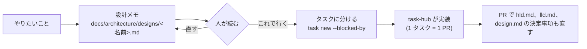

# 新しい機能の設計の進め方

機能を足す前に、[hld.md](hld.md) と [lld.md](lld.md) のどこが変わるかを 1 枚の設計メモにします。メモができたら
タスクに分けて task-hub に登録し、PR では HLD と LLD も一緒に直します。

設計メモは `system-designer` エージェントに頼めます(Claude Code で「system-designer で ○○ を設計して」)。
エージェントは図と変更点の案を書くだけで、コードは書きません。決めるのは人です。

## 流れ



- 小さな変更(1 つの関数の中で済み、ファイルの形式も外部の呼び出しも変わらない)なら、メモは要りません
- メモは Goal のもとになります。各タスクの Goal には、メモのどの節を実装するかと、受け入れ条件を書きます
- HLD と LLD は、コードと同じ PR で直します。あとで直すと、すぐに実物とずれます

## 設計メモのひな形

````markdown
# <機能の名前>

## 何を、なぜ
- 困っていること(誰が、いつ、何に)
- やること / やらないこと

## 変わる部品(HLD)
- 足す、変える部品と、その責任(hld.md の 3 章の表の行)
- 図: 変わる部分だけの flowchart(変わる箱に「変更」「新規」と書く)

## 流れ(LLD)
- sequenceDiagram: 誰が、何を、どの順で呼ぶか
- Status、段階、出来事が増えるなら stateDiagram と StatusLifecycle の変更

## データ
- 増える、変わるファイルや欄(lld.md の 5 章の表の行): 書く者、読む者、形式
- GitHub に増える欄や設定(人が画面ですることも)

## 外部の呼び出しと費用
- 増える GitHub の呼び出し(GraphQL のポイント、REST の回数)と、いつ呼ぶか
- task watch の 1 時間あたりの費用の見積もり(今は約 60 ポイント)

## 失敗したとき
- 何が失敗しうるか、そのとき実行・watch・コマンドはどうなるか(止めない、が基本)
- 複数のプロセスが同じファイルを書かないか(lld.md の 6 章)

## 互換性
- 古い bin/task、古い mod や拡張、今ある手元のファイルとの組み合わせ
- Windows

## 確かめ方
- 再現テスト(利用者から見た動き)と、守る約束(lld.md の 9 章に足すもの)
- 実際のボードで確かめること

## タスクの分け方
- 1 タスク = 1 つの関心事 = 1 PR。前後関係(--blocked-by)と受け入れ条件

## HLD・LLD に入れる変更
- 実装の PR で hld.md、lld.md、design.md に入れる変更の箇条書き

## ドキュメントとのずれ
- 設計中に見つけた、ドキュメントとコードの食い違い(コードが正)

## 決めてほしいこと
- 人が決めること。推測で埋めない
````
