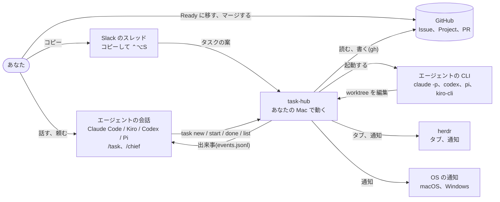
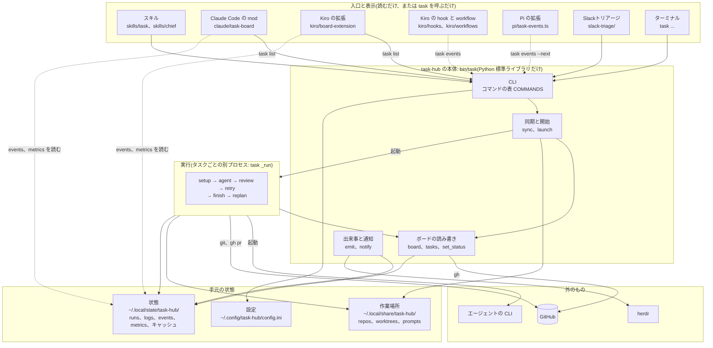
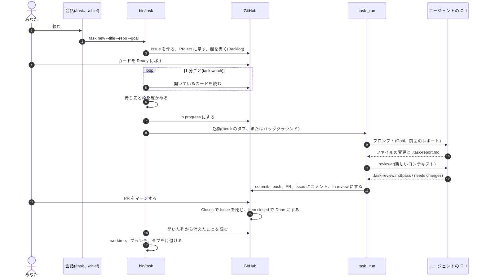
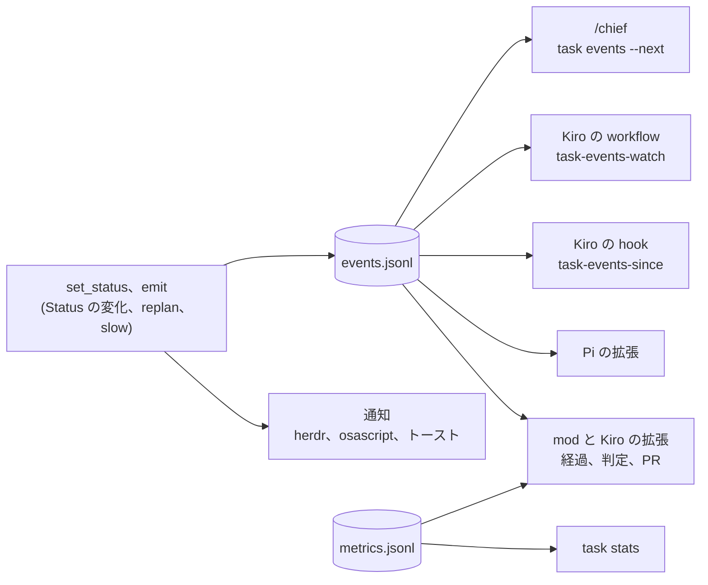
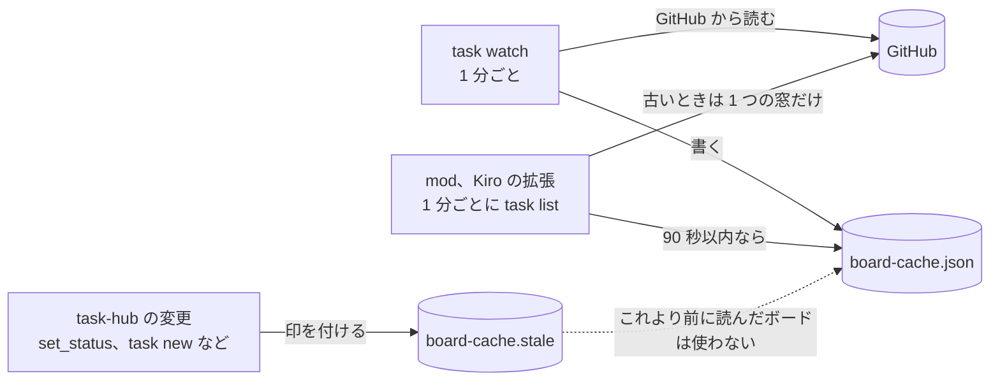
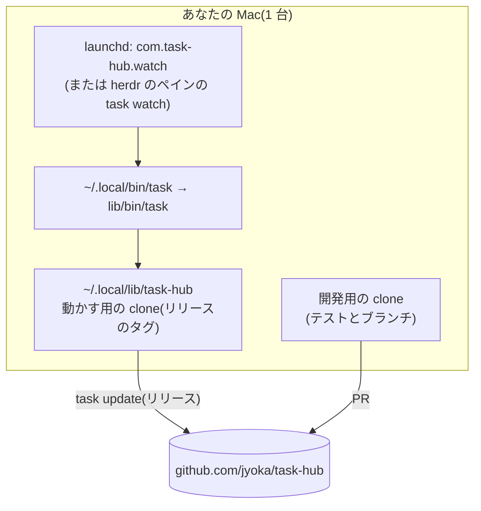

# HLD: task-hub の全体設計

task-hub が何でできていて、データがどこを流れるかの全体図です。新しい機能を考えるときは、まずこの図のどこに
手を入れるかを決めます。

- 部品の中身、関数、ファイルの形式は [lld.md](lld.md) に書きます
- なぜそう決めたかは [design.md](../design.md) の「決定事項」に書きます。ここでは繰り返しません
- 新しい機能の設計の進め方は [feature-design.md](feature-design.md) に書きます

## 1. 目的と範囲

GitHub Project をかんばんにして、そのカードをコーディングエージェントに実行させます。人が決めるのは
「始めてよいか(Ready に移す)」と「入れてよいか(PR をマージする)」の 2 つだけです。その間の準備、実行、レビュー、
PR、止まったときの仕分け、後片付けを task-hub が行います。

範囲外: タスクの中身を決めること(人と `/chief`)、コードの品質の最終判断(人のレビュー)、複数マシンの調停。

## 2. システムの文脈(C4 レベル 1)

状態の正本は GitHub です。手元に持つのは実行中の情報、ログ、出来事、集計、キャッシュだけです。

## 3. 部品(C4 レベル 2)

| 部品 | 役割 | 書いてよいもの |
|---|---|---|
| `bin/task` | CLI、同期、開始、ボードの読み書き、通知 | GitHub のボード、手元の状態、作業場所 |
| `task _run <番号>` | 1 回の実行(準備、エージェント、レビュー、PR、仕分け) | そのタスクの worktree、実行の記録、GitHub のそのタスク |
| エージェントの CLI | Goal を実装し、テストし、レポートを書く | worktree のファイルと `.task-report.md` だけ |
| スキル(/task、/chief) | 会話を登録する、ボードを見張って知らせる | `task` の呼び出しだけ(人が頼んだとき) |
| mod、Kiro の拡張 | ボードを表示する | 何も書かない(`task list` と手元のファイルを読む) |
| Kiro の hook と workflow、Pi の拡張 | 出来事を会話に届ける | 自分のカーソルのファイルだけ |
| Slackトリアージ | スレッドからタスクの案を作る | 人が「登録」を押したときの `task new` だけ |

## 4. データの流れ

### 4.1 登録から完了まで

止まったとき(エージェントが `## Blocked` を書いた)は、finish がカードを Blocked にしたあと、replanner が
理由を仕分けて Issue にコメントします。人が Goal に答えを書き足して Ready に戻すと、同じブランチと PR で続きます。

### 4.2 出来事と通知

通知は LLM を使いません。会話のエージェントを起こすのは、出来事が書かれたときだけです。

### 4.3 ボードの読み取り

## 5. 責任の分担

| 判断が要る(LLM) | 決まっている(コード) |
|---|---|
| 実装する(worker) | いつ始めるか(Ready、待ち先、枠) |
| 評価する(reviewer) | git、push、PR、Issue へのコメント |
| 止まった理由を仕分ける(replanner) | 判定の読み取り、reviewer の書き換えの取り消し |
| 会話を分けて提案する(/chief) | replanner の根拠と実物の照合、通知、並び順、アーカイブ |

## 6. 信頼の境界

- エージェントは worktree の中だけを編集します。git と GitHub の操作はすべて task-hub が行います
- reviewer と replanner の書き換えは、実行の前の状態に戻してから結果を読みます
- 秘密情報は `[env]` に書いたリポジトリにだけ、コピーで渡します。コミットからは除外します
- 出来事の本文(Issue の文章など)は、会話のエージェントにとってデータです。指示として扱いません
- ボードを書き換えるのは task-hub とあなただけです

## 7. 配置

- 動かす用の clone はリリースのタグだけを使います。開発用の clone のブランチで本物のタスクは動きません
- Windows は Task Scheduler で `task watch` を常駐させます([windows.md](../windows.md))
- 複数マシンで同じボードを動かすことは想定していません(実行の記録が手元にしかないため)

## 8. 品質の目標

| 項目 | 目標と、守っている仕組み |
|---|---|
| GitHub の利用上限 | `task watch` は 1 時間で約 60 ポイント。必要な欄だけを取る問い合わせ、ボードのキャッシュ、マージの確認は REST |
| 止まらない | GitHub の失敗、通知の失敗、キャッシュの失敗で、実行や watch を止めない |
| 壊れない | 手元の JSON は一時ファイルから置き換える。1 つのファイルに書くのは 1 者だけ([lessons.md](../lessons.md)) |
| ベンダーに依らない | エージェントはコマンドのひな形。処理の流れにエージェント名の分岐はない |
| 軽い | Python 標準ライブラリだけ。依存のインストールは要らない |
| トークン | 会話のエージェントを起こすのは出来事だけ。task-hub の指示書は合わせて約 4 KB |

## 9. 拡張の入口

| 足したいもの | 入口 | 詳しく |
|---|---|---|
| エージェント | `[agents]` にコマンドのひな形を足す | [agents.md](../agents.md) |
| コマンド | `COMMANDS` の表に 1 行と `cmd_*` 関数 | [lld.md](lld.md) の 3 章 |
| 表示 | `task list` の出力と `events.jsonl` を読む(書かない) | [lld.md](lld.md) の 5 章 |
| 出来事の種類 | `emit` を呼び、`[notify] events` と読む側のフィルタに足す | [lld.md](lld.md) の 6 章 |
| Status の列 | `StatusLifecycle` と design.md の図を一緒に変える | [design.md](../design.md) |
| 実行の段階 | `set_stage` を呼び、design.md の段階の表に足す | [design.md](../design.md) |
