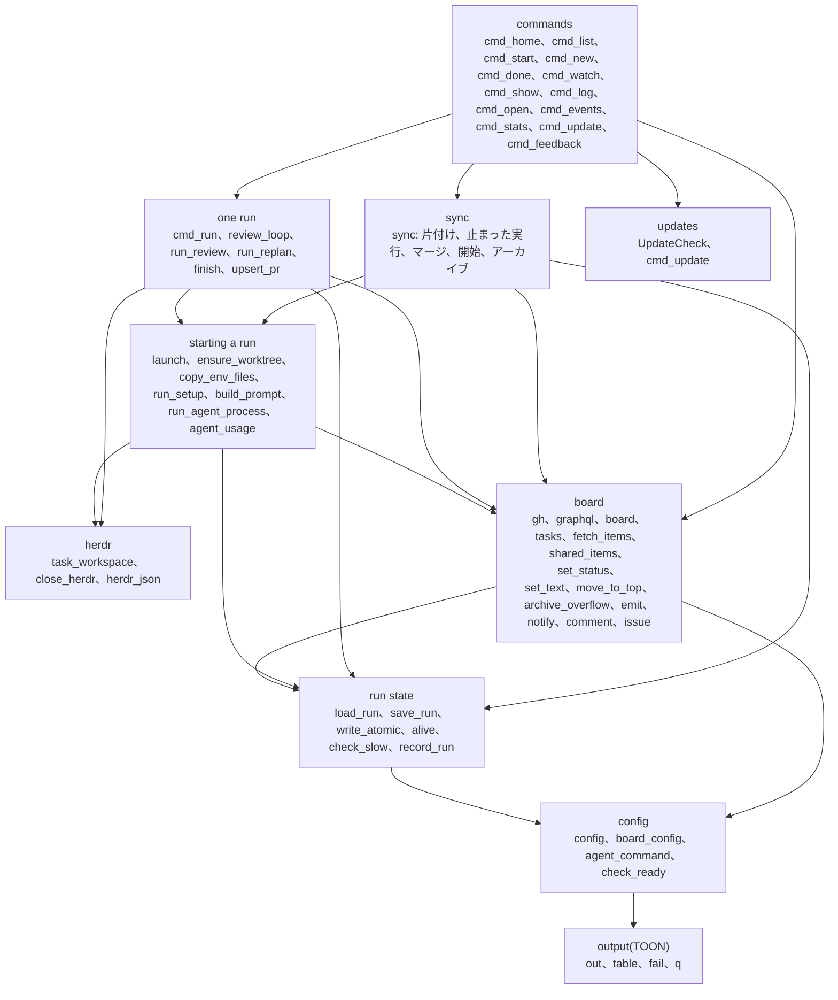
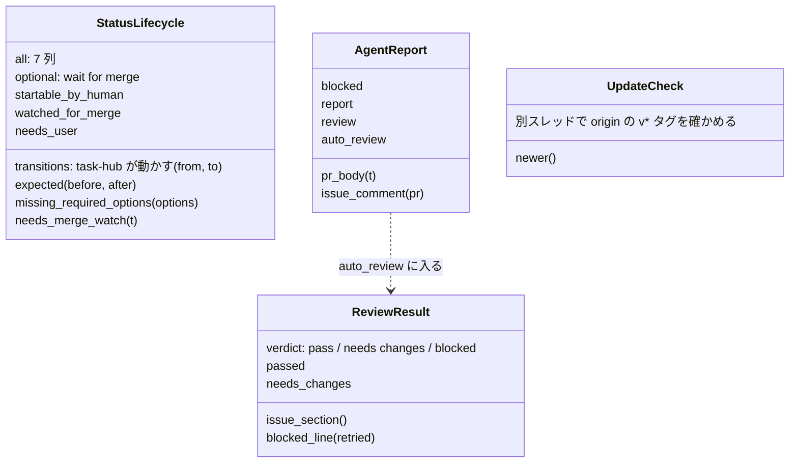
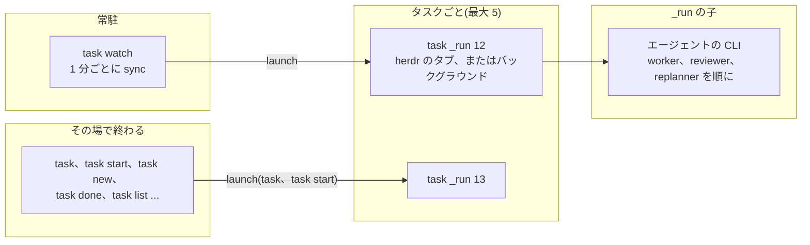
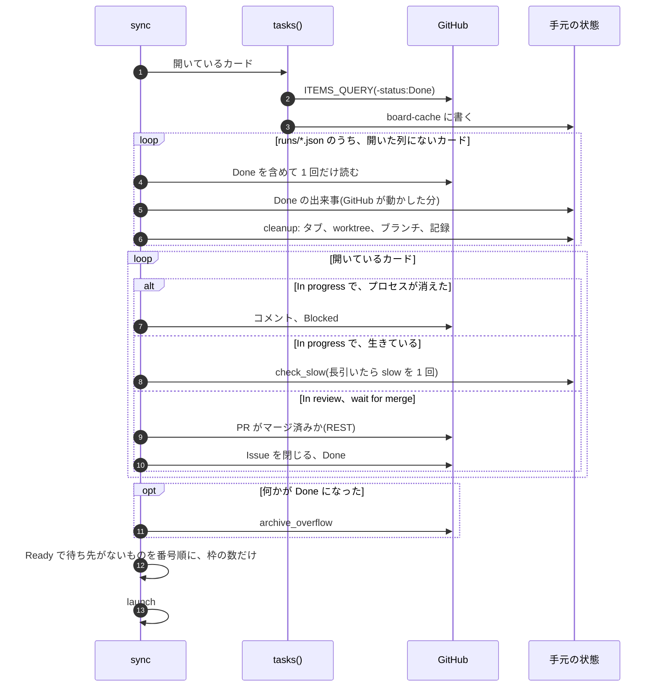
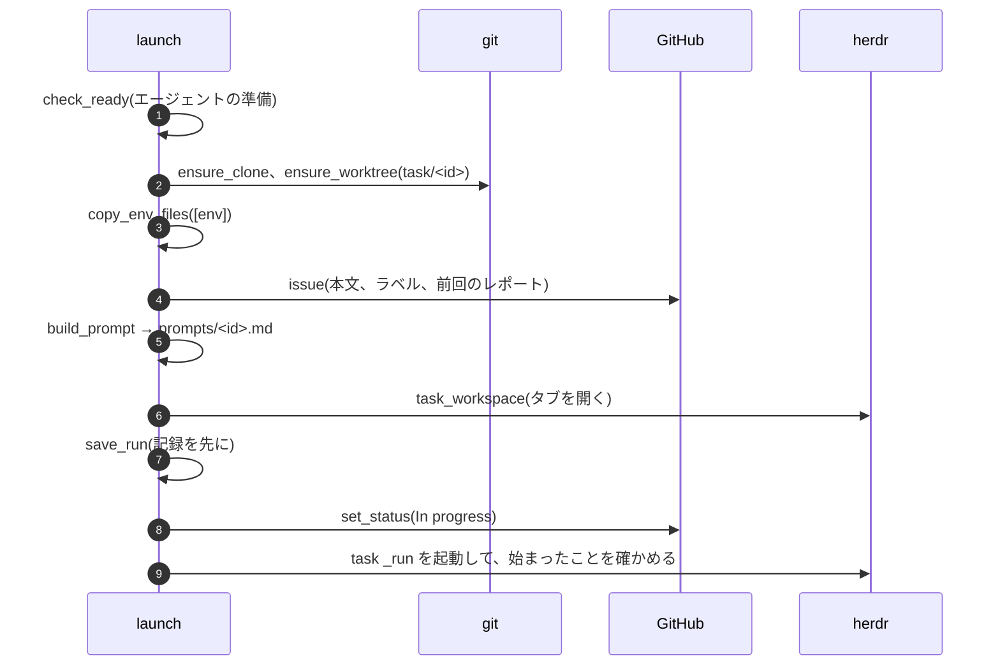
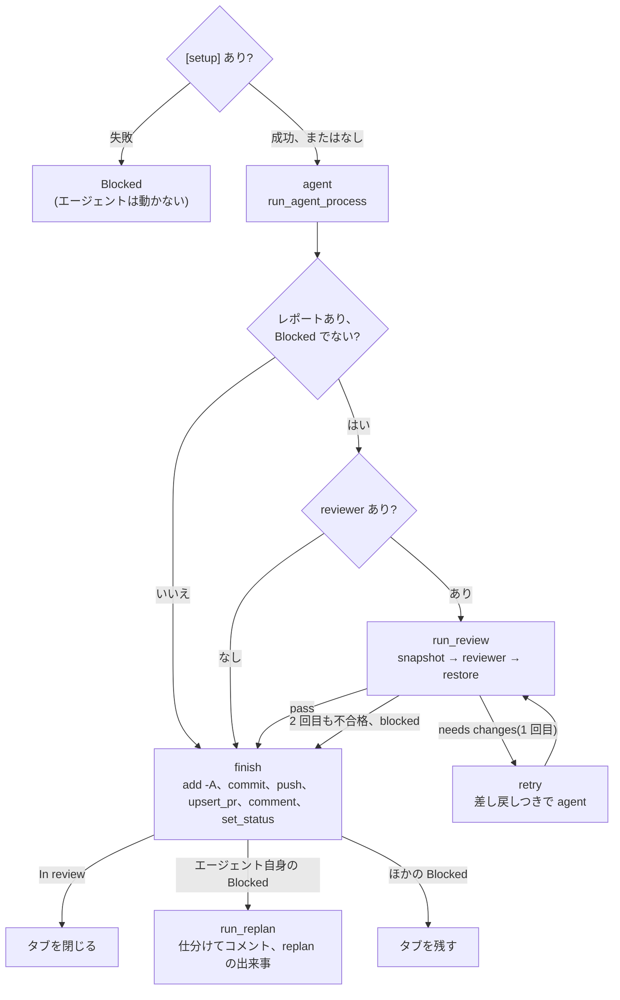
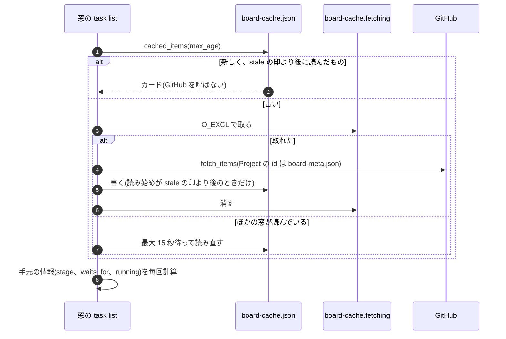

# LLD: task-hub の詳細設計

[hld.md](hld.md) の部品の中身です。関数、プロセス、ファイルの形式、外部の呼び出し、守るべき約束を書きます。
関数名は `bin/task` のものです。行番号は変わるので書きません(`grep -n "^def <名前>" bin/task` で探します)。

## 1. bin/task の構成

1 ファイル(約 2,900 行、Python 3.10 以上の標準ライブラリだけ)を、見出しのコメント `# ---------- ... ----------` で
分けています。上の層は下の層だけを呼びます。



### クラス



タスクは dict で持ちます(クラスにしていません)。ボードの値(`tasks()` が作る)と、手元の実行の記録(`load_run`)を
`{**load_run(id), **ボードの値}` で重ねたものです。

| キー | 出どころ | 意味 |
|---|---|---|
| `id`、`title`、`url` | GitHub(Issue) | Issue の番号、タイトル、URL |
| `item` | GitHub(Project) | カードの id(`set_status` などで使う) |
| `status`、`repo`、`agent`、`base` | GitHub(欄) | Status、Target repo、Agent、Base branch |
| `updated`、`closed` | GitHub | カードを最後に変えた時刻、Issue が閉じているか |
| `blockers`、`waits_for` | GitHub + 計算 | Blocked by のリンク、まだ始められない理由 |
| `branch`、`worktree`、`pid`、`tab`、`workspace`、`log`、`pr`、`stage`、`started` | 手元(`runs/<id>.json`) | 実行の情報 |
| `running` | 計算(`alive`) | 実行のプロセスが生きているか |

## 2. プロセス



- `launch` は実行の記録を書いてから In progress にし、`task _run` を起動します。herdr があればタブで、
  なければログ付きのバックグラウンドプロセスで動かします
- `task _run` は自分の pid を記録します。同期は `alive` でプロセスを確かめ、消えていてカードが In progress なら Blocked にします
- herdr のタブで動かすときは、環境変数を `HOME`、`PATH`、`TASK_*`、`GIT_AUTHOR_*`、`GIT_COMMITTER_*`、`[runner] pass_env` だけに絞ります

## 3. コマンド

| コマンド | 主な関数 | GitHub | 手元に書くもの |
|---|---|---|---|
| `task` | `sync(started_here=True)`、`cmd_home` | ボードを読む、開始、片付け | runs、events、asked |
| `task watch` | `archive_overflow`、ループで `sync` | 同上 + 開始時のアーカイブの確認 | 同上 |
| `task list [--max-age]` | `shared_items`、`tasks`、`list_lines` | キャッシュが古いときだけ読む | board-cache |
| `task start <id>` | `get`、`set_status(Ready)`、`sync` | 読む、Status | runs、events |
| `task new` | `cmd_new` | Issue、カード、欄、Blocked by | events、asked |
| `task done <id>` | `cleanup`、`set_status(Done)`、`archive_overflow` | Issue を閉じる、Status、アーカイブ | runs を消す、events |
| `task show`、`task log`、`task open` | `get`、`issue` | 読むだけ | なし |
| `task events`、`task stats` | `events_named`、`cmd_stats` | なし | なし |
| `task _run <id>` | `cmd_run` | 3.3 の図 | runs、logs、metrics、events |

新しいコマンドは `COMMANDS` の表に `名前: (関数, 位置引数, フラグ, 使い方)` を 1 行足し、`cmd_<名前>(a)` を書きます。
引数の解析、`--help`、エラーの形(`error:` と `help:` を stdout)は `main` が共通で行います。

## 4. 主な流れ

### 4.1 同期(`sync`、`task watch` の 1 回)



### 4.2 開始(`launch`)



### 4.3 1 回の実行(`cmd_run`)



`finish` の判定:

| 条件 | 結果 |
|---|---|
| レポートがない | Blocked(`agent exited without a report`) |
| reviewer が 2 回不合格、または blocked | Blocked(review) |
| レポートに `## Blocked` | Blocked(エージェント自身)→ replanner |
| 変更なし、research ラベルなし | Blocked(`changed no files`) |
| それ以外 | In review(変更があれば PR、research ならレポートだけ) |

### 4.4 ボードの読み取り(`task list`)



## 5. 手元のファイル

| ファイル | 書く者 | 読む者 | 形式 |
|---|---|---|---|
| `~/.config/task-hub/config.ini` | 人、インストーラ | すべて | INI(`[board]`、`[runner]`、`[agents]`、`[env]`、`[setup]`、`[check]`、`[ide]`、`[notify]`) |
| `state/runs/<id>.json` | `launch`、`task _run`(順番に)、`cleanup` が消す | すべて | JSON(`RUN_KEYS`) |
| `state/logs/<id>.log` | `task _run` | `task log` | テキスト |
| `state/events.jsonl` | `emit`(追記) | /chief、Kiro、Pi、mod、`task events` | JSON Lines |
| `state/metrics.jsonl` | `record_run`(追記) | `task stats`、mod の実績、`slow_threshold` | JSON Lines |
| `state/board-cache.json` | `fetch_items`(開いているカードを読んだとき) | `task list` | `{key, fetched_at, items}` |
| `state/board-cache.stale` | `gh()`(ボードを変える呼び出しのあと) | `cached_items` | UNIX 時刻 |
| `state/board-meta.json` | `board()` | `task list` だけ | `{key, at, board}` |
| `state/asked/<id>.json` | `task new`、`task`、`task start` | `task_workspace` | herdr の workspace |
| `state/update.json` | `UpdateCheck` | `task list`、`task watch` | 新しい版 |
| `share/repos/<owner>/<name>` | `ensure_clone` | worktree の元 | git |
| `share/worktrees/<id>` | `ensure_worktree`、エージェント | `finish`、`cleanup` | git worktree |
| `share/prompts/<id>.md` | `build_prompt` | `task _run` | Markdown |

`state` は `~/.local/state/task-hub`、`share` は `~/.local/share/task-hub` です。

### 出来事(events.jsonl の 1 行)

```json
{"time": "2026-10-10T02:33:41Z", "id": "156", "title": "...", "repo": "jyoka/x", "event": "In review",
 "pr": "https://github.com/...", "reason": "...", "digest": {"verdict": "pass", "review": "...", "pr": "..."}}
```

`event` は Status の名前(Backlog、Ready、In progress、In review、Blocked、Done)、`replan`、`slow` のどれかです。
空の欄は書きません。

### 実行の集計(metrics.jsonl の 1 行)

`id`、`title`、`repo`、`agent`、`reviewer`、`started`、`finished`、`seconds`、`status`、`reviews`(判定の列)、
`retried`、`blocked_by`、`replan`、`usage`(起動ごとのトークン、呼び出し、モデル)、`files`、`added`、`removed`。

## 6. 並行と所有

- 1 つのファイルを書くのは 1 者だけにします。`runs/<id>.json` は `launch` が作り、そのあとは `task _run` だけが
  書きます(同期は書かない。`slow` を 1 回だけにする判定も `events.jsonl` を見る)
- JSON はすべて `write_atomic`(一時ファイルから置き換え。Windows は置き換えを試し直す)で書きます。読む側は
  古いか新しいかの完全なファイルだけを見ます
- 追記のファイル(events、metrics)は 1 行ずつ書きます。書けなくても実行もコマンドも止めません
- 同じタスクの実行は 1 つだけです。プロセスが生きているタスク(`alive`)は、Status が何でも開始しません
- キャッシュは正しさに関わりません。書けない、読めない、壊れているときは GitHub から読むだけです

## 7. 外部の呼び出し

| 呼び出し | API | 費用 | いつ |
|---|---|---|---|
| `PROJECT_QUERY`(Project の id と欄) | GraphQL | 1 | コマンドごと(`task list` は 1 時間取っておく) |
| `ITEMS_QUERY`(カード) | GraphQL | 100 枚ごとに 1 | 同期ごと、キャッシュが古い `task list` |
| `project item-edit`(Status、欄) | GraphQL(gh) | 1 前後 | Status を変えるとき |
| `MOVE_TO_TOP` | GraphQL | 1 | Status を変えるとき |
| `ARCHIVE_ITEM` | GraphQL | 1 枚ごとに 1 | 100 枚を超えたとき |
| `ADD_BLOCKED_BY` | GraphQL | 1 | `task new --blocked-by` |
| PR がマージ済みか | REST | 1 回 | In review と wait for merge のカードごと、同期ごと |
| Issue の作成、コメント、閉じる、PR の作成と更新 | `gh issue`、`gh pr`(gh の中で GraphQL) | gh 任せ(測っていない) | 登録、実行の終わり |
| `git fetch`、`push` | git | - | 開始、終わり |

GraphQL は 1 時間 5000 ポイント、REST は 1 時間 5000 回です(アカウント全体で共有)。

## 8. 失敗の扱い

| 失敗 | 扱い |
|---|---|
| GitHub の失敗(同期の中) | その回の `github_errors` に出し、次の回にまた試す。watch は止めない |
| GitHub の失敗(実行の終わり) | レポートを worktree に残し、次の同期が止まった実行として Blocked にする |
| 開始の失敗 | カードを Blocked にし、理由をコメントする |
| 通知、キャッシュ、集計、カードの並べ替えの失敗 | 無視する(実行とコマンドを止めない) |
| エージェントの異常終了 | レポートがなければ Blocked。途中までの変更は push する |
| Project の id が古い | 書き込みが失敗したら `forget_board` で捨て、次は読み直す |

## 9. 守る約束(テストで確かめているもの)

1. エージェントが git と GitHub を操作しなくても、PR の形式はコードで決まる
2. reviewer と replanner の書き換えは結果に残らない
3. task-hub が動かす Status の遷移は `StatusLifecycle.transitions` の表と、design.md の図と一致する
4. 生きている実行のあるタスクで、2 つ目の実行は始まらない
5. 変更の前に読み始めたボードは、変更のあとに表示されない
6. 開いているカードと、Issue が開いている Done のカードはアーカイブされない
7. Ready のカードは作った順に始まる
8. 手元の JSON は、書き込みの途中で読んでも壊れていない

## 10. テストの仕組み

- `tests/test_task.py`: `bin/task` を別プロセスで動かすブラックボックスのテスト。GitHub は 1 つの JSON ファイルを
  持つ偽物の `gh`、作業先は手元の bare リポジトリ、エージェントはゴールの `MODE:` で動きを変える偽物の CLI です
- `tests/test_install.py`: インストーラ、`doctor`、アンインストール
- `tests/test_windows.py`: Windows だけ(GitHub Actions の windows-latest)
- `claude/task-board/hooks/*.test.tsx`(`claude plugin test`)、`kiro/board-extension/test`(`npm test`)
- `python3 tests/run.py`: テストを 1 件ずつ別プロセスで並べて動かす(約 3.5 分)
