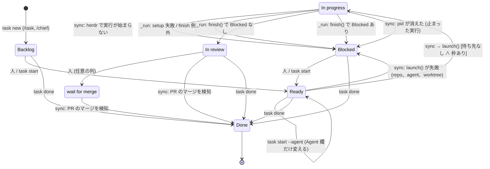
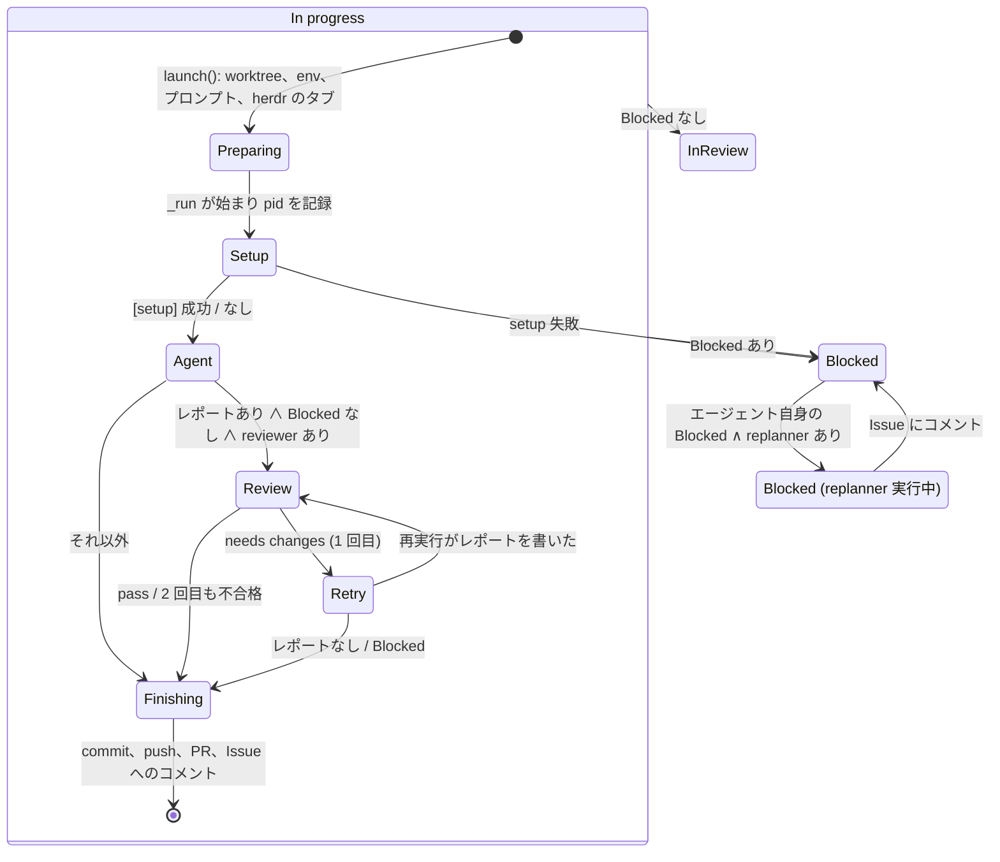

# ステートチャートとアクターから見た task-hub (2026-10-01)

ステートマシン、ステートチャート、アクターの考え方を、task-hub の今後の進化にどう使えるかをまとめます。
**取り入れるのは考え方だけで、ライブラリは入れません。** 図と遷移表は 0.6.0 (f40d606) の `bin/task` から洗い出しました。

## 1. 概念

| 概念 | 要点 | 代表例 |
|---|---|---|
| ステートマシン | 状態と遷移を明示する。「この状態でこのイベントが来たら、この状態へ」 | 遷移表 |
| ステートチャート (Harel, 1987) | ステートマシンに **階層** (状態の中の状態)、**並行領域** (独立した状態を同時に持つ)、**ガード** (遷移の条件)、**entry/exit アクション** を足したもの | SCXML (W3C)、XState |
| アクター | 自分の状態を持ち、メッセージだけでやり取りする。共有状態を持たない。**スーパーバイザー** が失敗したアクターを見張り、再起動するか上に知らせる | Erlang/OTP、Akka、XState v5 |
| Durable execution | 手順ごとに記録を残し、クラッシュしても途中から再開する | Temporal |

## 2. task-hub はすでに暗黙のステートチャートとアクター

| 概念 | task-hub の今の姿 |
|---|---|
| 状態 | Status 列の 7 つ (`StatusLifecycle`, `bin/task:119`) |
| ガード | 開始の判定「Ready、待ち先なし、枠が空いている」(`sync`, `bin/task:1362`) |
| 階層 (見えていない) | In progress の中に、準備 → setup → agent → review → 差し戻し → finish がある (`launch`、`cmd_run`、`review_loop`) |
| 並行領域 (混ざっている) | ボードの Status、手元の実行 (pid の生死)、PR の状態の 3 つを `sync` の if 文で組み合わせている |
| アクター | `task _run` の 1 プロセスが 1 アクター。`events.jsonl` がメールボックスで、`/chief` はそれを読むアクター |
| スーパーバイザー | `sync` が止まった実行を見つけて Blocked にする (Erlang の let it crash から、人への報告へ) |

## 3. 今の遷移 (0.6.0)

### Status の遷移

図にない遷移が 2 種類あります。

- **人がボードで動かすもの**: GitHub の画面ではどの列からどの列へも動かせます。task-hub は読んだ Status をそのまま信じます。
- **GitHub のワークフロー**: 「Item closed」は Issue が閉じるとどの列からでも Done にします。ほかの Status を変えるワークフローは
  task-hub の Status を上書きします (`docs/design.md` 既知の制限)。

### `set_status` を呼ぶ場所

| 遷移 | どこで | 行 |
|---|---|---|
| (なし) → Backlog | `cmd_new` | `bin/task:1719` |
| Backlog / Blocked / Ready → Ready | `cmd_start` | `bin/task:1769` |
| Ready → In progress | `launch` (herdr で始まったかを確かめる **前**) | `bin/task:835` |
| Ready / In progress → Blocked | `sync` (launch の失敗) | `bin/task:1423` |
| In progress → Blocked | `cmd_run` (setup 失敗) | `bin/task:1222` |
| In progress → In review / Blocked | `finish` | `bin/task:1296` |
| In progress → Blocked | `cmd_run` (finish の例外) | `bin/task:1258` |
| In progress → Blocked | `sync` (pid が消えた) | `bin/task:1388` |
| In review / wait for merge → Done | `sync` (マージを検知) | `bin/task:1392` |
| Done 以外 → Done | `cmd_done` (In progress は pid が消えているときだけ) | `bin/task:1786` |

遷移を決める場所は 10 か所あり、正しい遷移の一覧はコードのどこにもありません。

### In progress の中 (階層)

### 図にして分かったこと

1. **Status と実行中のプロセスがずれる期間が 2 つあります。**
   - `launch` は herdr で実行が始まったことを確かめる前に In progress にします。始まらなければ Blocked にしますが、
     ペインではあとから実行が始まることがあります (`docs/design.md` の未対応の指摘。コードの経路は確認済み、あとから始まるかは推測)。
   - replanner は `finish` が Blocked にした **あと** に走ります。その間、カードは Blocked なのにプロセスは生きています。
     ここで人が Ready に戻すと、`sync` は Ready のカードの pid を見ないので、同じ worktree で次の実行を始めえます。
     `task done` も In progress のときしか pid を見ません (推測。テストはまだありません)。
2. **Blocked には 8 つの原因が混ざっています** (`metrics.jsonl` の `blocked_by`: setup、start、agent、review、no report、
   no changes、finish error、止まった実行)。原因は記録にはありますが、状態としては 1 つです。
3. **人と GitHub のワークフローによる遷移には、ガードがありません。**

## 4. 効きそうな箇所

| 既知の課題・まだ検証できること | 効く概念 | 効果 |
|---|---|---|
| 遷移が 10 か所の `set_status` で決まり、不正な遷移を検知できない | 遷移表 + ガード | 想定外の遷移をコードとテストで見つけられる |
| GitHub のワークフローが Status を上書きする | 外からのイベントとして扱う | 「誰かが外から変えた」を見つけて知らせられる |
| 同じ worktree に 2 つの実行 (上の 1) | 「プロセスが生きている」を状態として扱うガード | 二重の実行を構造で防げる |
| `/chief` の費用 | 階層の副状態を見せる | `In progress › review (2/2)` のような要点だけで判断できる |
| replanner の `answered` で自動的に Ready に戻す第 2 段階 (lessons 11) | ガード付きの遷移 + 回数 | `MAX_REPLAN_ANSWERS` を遷移の条件として書ける |
| 長時間の実行とスリープする Mac (lessons 8) | Durable execution | review まで済んだところから再開できる |
| 1 つの Project を 1 台でしか使えない | アクターの持ち主 (リース) | どのマシンがタスクを持っているかを明示できる |

## 5. ロードマップ

### Phase 0: 遷移表と図 (tasks#39)

- `StatusLifecycle` に task-hub 自身の遷移の表を持たせ、`set_status` で照らし合わせる。表にない遷移は警告するが止めない
- 全遷移を確かめるテストを足す
- 上の図を `docs/design.md` に載せる

### Phase 1: 実行中の段階を見せ、生きているプロセスをガードにする (tasks#40、#39 のあと)

- 実行の段階 (preparing / setup / agent / review / retry / finishing / replanning) を手元の run の記録に残し、`task list` と `task show` に出す
- イベント (`events.jsonl`) には足さない。`/chief` を起こす回数が増えて費用が上がるため
- プロセスが生きているタスクは、Status が何であっても開始と `task done` をしない

### Phase 2: ガード付きの新しい遷移 (実績が溜まったら)

- replanner の `answered` で自動的に Ready に戻す (回数の上限つき)
- 外から変わった Status を見つけて知らせる (前回読んだ Status を手元に持つ)
- 同じファイルを変える 2 つの PR の競合を、イベントとして扱う (lessons 7)

### Phase 3: アクターと Durable execution (必要が実証されたら)

- 実行の段階ごとに記録を残し、途中から再開する (スリープ対策)
- タスクごとに持ち主のマシン (リース) を持ち、1 つのボードを複数のマシンで使う

### やらないこと

- **XState、python-statemachine、transitions などのライブラリ**: 1 ファイルの Python CLI に依存が増えるだけです
  (シンプルさのルール 2)
- **Temporal、Akka、Ray**: 規模に対して過剰です
- **ステートチャートの実行エンジンを自作すること**: 表と図とテストで十分です
